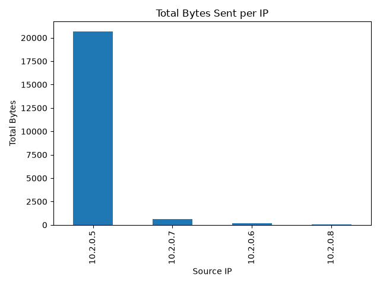

# Network Triage Tool

A command-line security tool that analyzes network connection logs to identify activity worth investigating.

The tool identifies the top data-sending host ("top talker"), analyzes failed connection attempts, calculates failure rates, and flags IP addresses showing repeated suspicious behavior.

It uses a functional data-analysis pipeline:

**load → clean → analyze → report → visualize**

The full pipeline runs with a single command.

## Features

- **Automated pipeline** — one command runs the full load-to-report workflow
- **Data cleaning** — invalid or missing required data is removed and reported
- **Top talker detection** — identifies the source IP sending the most bytes
- **Connection analysis** — counts total connections for each source IP
- **Failed-connection analysis** — counts failed attempts per source IP
- **Failure-rate calculation** — calculates the proportion of failed connections for each IP
- **Suspicious-IP detection** — flags IPs showing repeated failures and a high failure rate
- **Target-port identification** — records the destination ports contacted by flagged IPs
- **Text report** — findings are saved to `data/triage_report.txt`
- **Traffic visualization** — total bytes per IP are saved to `data/top_talkers.png`
- **Failed-attempt visualization** — failed attempts per IP are saved to `data/failed_attempts.png`
- **Error handling** — a missing input file is handled cleanly instead of crashing
- **Automated testing** — core analysis functions are tested using pytest

## Suspicious Activity Rule

An IP address is flagged for further investigation when both conditions are met:

- It has at least **3 failed connection attempts**
- Its failure rate is at least **50%**

For example, an IP with 3 failed connections out of 3 total connections has a 100% failure rate and is flagged.

The rule is intentionally simple and explainable. It is designed for basic triage rather than production-level intrusion detection.

## Project Structure

```text
capstoneproject/
├── data/
│   ├── connections.csv
│   ├── triage_report.txt
│   ├── top_talkers.png
│   └── failed_attempts.png
├── src/
│   ├── __init__.py
│   ├── main.py
│   ├── logic.py
│   └── utils.py
├── tests/
│   └── test_logic.py
├── requirements.txt
├── .gitignore
└── README.md
```

## Setup

Install the required dependencies:

```bash
pip install -r requirements.txt
```

## Usage

From the project root directory, run:

```bash
python src/main.py
```

The program will:

1. Load `data/connections.csv`
2. Clean invalid or missing required data
3. Analyze network activity by source IP
4. Identify the top talker
5. Calculate connection counts, failed attempts, and failure rates
6. Flag suspicious IP addresses
7. Write the findings to `data/triage_report.txt`
8. Generate `data/top_talkers.png`
9. Generate `data/failed_attempts.png`

## Example Output

```text
Report written to data/triage_report.txt
Chart saved to data/top_talkers.png
Failed-attempt chart saved to data/failed_attempts.png
```

Example suspicious activity from the generated report:

```text
=== SUSPICIOUS ACTIVITY ===

IP: 10.2.0.7
Total bytes: 650
Connections: 3
Failed attempts: 3
Failure rate: 100%
Target ports: [8080]
Reason: Repeated failed connections with high failure rate
```



## Input Format

The tool expects a CSV file at `data/connections.csv` containing these columns:

```text
timestamp,src_ip,dst_port,protocol,bytes,status
```

## Testing

Run the automated tests with:

```bash
python -m pytest -q
```

The current tests verify:

- Invalid byte values are removed during data cleaning
- The correct top talker is identified
- Repeated failed connections are correctly flagged as suspicious

A successful test run should show:

```text
3 passed
```

## Design Decisions

### Reporting dropped rows instead of deleting them silently

When the tool removes rows containing missing or invalid required values, it reports how many rows were dropped.

In a security context, malformed data can be important. It may result from corrupted logs, bad collection, unexpected input, or potentially deliberate manipulation. Reporting the loss makes the behavior visible instead of silently hiding it.

### Explainable suspicious-activity detection

The tool uses a simple rule based on both the number of failed attempts and the failure rate.

Using both values avoids treating every single failed connection as suspicious. For example, one failed connection may be normal, while three consecutive failures with a 100% failure rate deserve more attention.

The rule is intentionally transparent so an analyst can understand why an IP was flagged.

### Functional design rather than OOP

The application follows a linear pipeline:

**load → clean → analyze → report → visualize**

Functions that receive data, process it, and return results fit this workflow naturally. Using classes would add structure that this small application does not currently require.

## Known Limitations & Future Work

- **Quarantine malformed rows** — invalid rows are currently dropped after being reported. A forensic-oriented version could save them to a separate file for later inspection.
- **Configurable input path** — the input path is currently fixed. A command-line argument could allow analysts to process different log files.
- **Configurable detection thresholds** — the failure-count and failure-rate thresholds are currently fixed in the code.
- **Additional detections** — future versions could detect port scanning, unusual protocols, repeated access to multiple ports, or other network anomalies.
- **Larger datasets** — the current project is designed as a lightweight triage tool rather than a production-scale network monitoring system.

## Technologies

- Python 3
- pandas
- matplotlib
- pytest

## Author

Tasnim